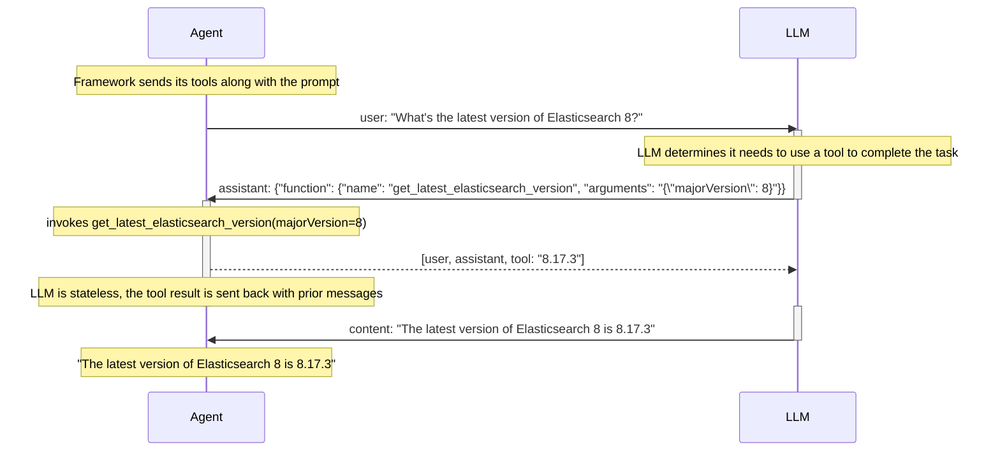

# Function Calling in Generative AI Agents

Generative AI (GenAI) frameworks empower developers to build applications that
handle tasks beyond the large language models (LLMs) core knowledge.

Here are some GenAI frameworks features that contribute to choice and velocity:
* Standardized interfaces for LLMs and VectorDBs
* Tool/function support retrieving new knowledge or executing tasks
* Orchestration of common patterns, such as RAG or agent function calling loops

This directory contains examples of the GenAI agent function calling loop
pattern, applied to several frameworks in multiple languages. Notably, this
includes observability using Elastic Distributions of OpenTelemetry (EDOT) SDKs
and Kibana.

Here are the examples:

* [Semantic Kernel .NET](semantic-kernel-dotnet)
* [Spring AI (Java)](spring-ai)
* [Vercel AI (Node.js)](vercel-ai)

## Example application flow

Regardless of programming language or GenAI framework in use, each example
performs the same process. The user asks a question that is beyond the training
date of the LLM. The application uses the framework to implement an agent
pattern to automatically call functions when it needs new information.

Here's how the question "What's the latest version of Elasticsearch 8?" ends up
being answered.

The GenAI framework not only abstracts the above loop, but also LLM plugability
and tool registration. This simplifies swapping out LLMs and also enables
flexibility in defining and testing functions.

## Observability with EDOT

Each example uses a framework with built-in OpenTelemetry instrumentation.
While features vary, each of these produces at least traces, and some also logs
and metrics.

We use Elastic Distributions of OpenTelemetry (EDOT) SDKs to enable these
features and fill in other data, such as HTTP requests underlying the LLM and
tool calls. In doing so, this implements the "zero code instrumentation"
pattern of OpenTelemetry.

Here's an example Kibana screenshot of one of the examples, looked up from a
query like: http://localhost:5601/app/apm/traces?rangeFrom=now-15m&rangeTo=now

