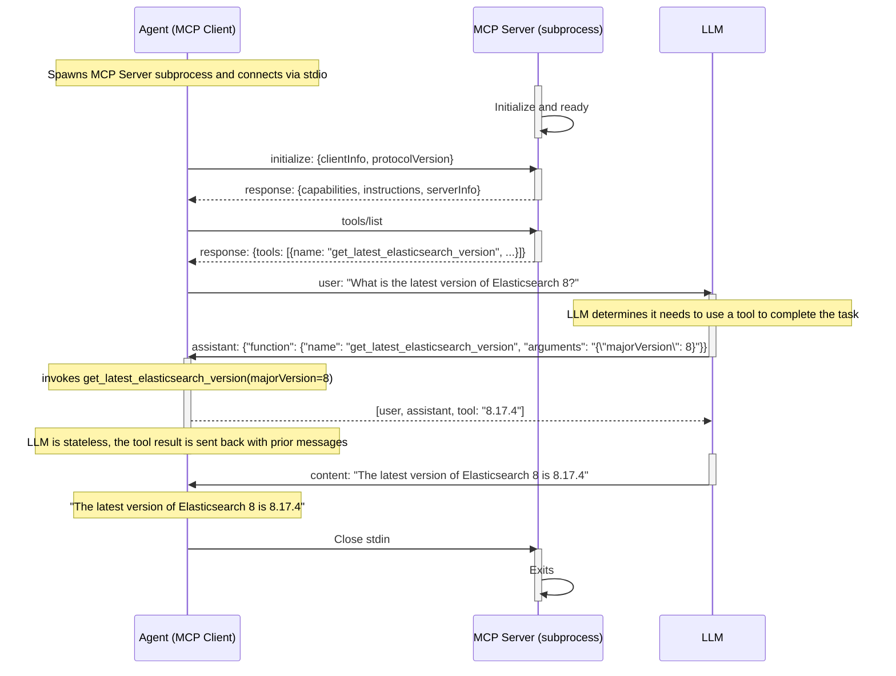

# Function Calling in Generative AI Agents

Generative AI (GenAI) frameworks empower developers to build applications that
handle tasks beyond the large language models (LLMs) core knowledge.

Here are some GenAI frameworks features that contribute to choice and velocity:
* Standardized interfaces for LLMs and VectorDBs
* Tool/function support retrieving new knowledge or executing tasks
* Orchestration of common patterns, such as RAG or agent function calling loops

This directory contains examples of the GenAI agent function calling loop
pattern, applied to several frameworks in multiple languages. Notably, this
includes observability using Elastic Distributions of OpenTelemetry (EDOT) SDKs
and Kibana.

Here are the examples:

* [OpenAI Agents SDK (Python)](openai-agents)
* [Semantic Kernel .NET](semantic-kernel-dotnet)
* [Spring AI (Java)](spring-ai)
* [Vercel AI (Node.js)](vercel-ai)

## Example application flow

Regardless of programming language or GenAI framework in use, each example
performs the same process. The user asks a question that is beyond the training
date of the LLM. The application uses the framework to implement an agent
pattern to automatically call functions when it needs new information.

Here's how the question "What is the latest version of Elasticsearch 8?" ends up
being answered.


The GenAI framework not only abstracts the above loop, but also LLM plugability
and tool registration. This simplifies swapping out LLMs and also enables
flexibility in defining and testing functions.

## Observability with EDOT

The OpenTelemetry instrumentation approach varies per GenAI framework. Some are
[native][native] (their codebase includes OpenTelemetry code), while others
rely on external instrumentation libraries. Signals vary as well. While all
produce traces, only some produce logs or metrics.

We use Elastic Distributions of OpenTelemetry (EDOT) SDKs to enable these
features and fill in other data, such as HTTP requests underlying the LLM and
tool calls. In doing so, this implements the "zero code instrumentation"
pattern of OpenTelemetry.

Here's an example Kibana screenshot of one of the examples, looked up from a
query like:

http://localhost:5601/app/apm/traces?rangeFrom=now-15m&rangeTo=now


## Prerequisites

Docker or Podman is required. You'll also need an OpenAI API compatible
inference platform and an OpenTelemetry collector.

First of all, you need to be in a directory that contains this repository. If
you haven't yet, you get one like this:
```bash
curl -L https://github.com/elastic/observability-examples/archive/refs/heads/main.tar.gz | tar -xz
cd observability-examples-main/genai-function-calling/
```

### Podman

If you are using [Podman](https://podman.io/) to run docker containers, export
`HOST_IP`. If you don't you'll get this error running exercises:
> unable to upgrade to tcp, received 500

Here's how to export your `HOST_IP`:
  * If macOS: `export HOST_IP=$(ipconfig getifaddr en0)`
  * If Ubuntu: `export HOST_IP=$(hostname -I | awk '{print $1}')`

## Model Context Protocol flow

Some examples optionally use Model Context Protocol ([MCP][mcp]) for tool
discovery and execution.

This uses the "stdio" transport which involves launching a subprocess. For
convenience, the MCP server is defined in the same project as the normal
example.

The main difference is that instead of calling a local function to get the
latest version of Elasticsearch, the agent creates and MCP server process and
discovers the function via the MCP protocol. When the LLM uses that function,
it uses the same protocol to invoke the function. Otherwise, the flow is the
same.

Here's a diagram of the MCP variant, which notably augments the original by
decoupling tool discovery and execution from the agent, which is now also an
MCP client.



Note: If you are using OpenTelemetry, there's not yet a way to join traces
across the MCP process boundary. This means that the HTTP call to get the
latest version of Elasticsearch will be in a separate trace from the agent.
Please follow this [discussion][mcp-otel] in the MCP specification for updates.

---
[native]: https://opentelemetry.io/docs/languages/java/instrumentation/#native-instrumentation
[mcp]: https://modelcontextprotocol.io/specification
[mcp-otel]: https://github.com/modelcontextprotocol/modelcontextprotocol/discussions/269
