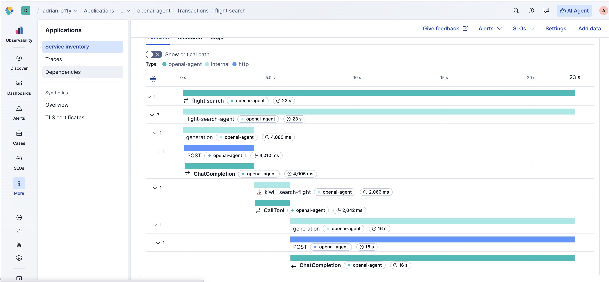

# Observable Inference Platforms

Inference Platforms serve or proxy LLMs with common features that enable
development.

* Emulation of OpenAI APIs even when the backend is not OpenAI
* Hosting of tools, to avoid applications needing to orchestrate them
* Guardrails to prevent misuse or leaking of sensitive information
* Observability available even when applications are not instrumented

This directory includes examples of OpenAI accessible inferences platforms and
proxies. Each are observable with OpenTelemetry compatible backends such as
Elastic Stack.

* [ArchGW](archgw) - [with tracing configuration][archgw]
* [Envoy AI Gateway](aigw) - with [OpenTelemetry tracing and metrics][aigw]
* [LiteLLM](litellm) - with  [OpenTelemetry logging callbacks][litellm]
* [LlamaStack](llama-stack) - with [OpenTelemetry sinks][llama-stack]
* [AgC](AgC) - with [OpenTelemetry export][AgC]
* [vLLM](vllm) - with [OpenTelemetry POC][vllm] configuration

If you use Elastic Stack, an example would look like this in Kibana:



## Prerequisites

Docker, Python and an OpenTelemetry collector are required. Proxy examples
require Ollama as well.

All examples use Docker to run the inference platform or proxy and are tailored
with instructions that work with Apple Silicon. Accordingly, do not assume
production deployments will have similar configuration.

All examples use [chat.py](chat.py) to make an OpenAI request. This is invoked
with `uv` to avoid confusion between its dependencies and that of a server. If
you need `uv` installation instructions, see their [docs][uv].

### OpenTelemetry Collector

OpenTelemetry is a framework used to collect and export telemetry signals
(logs, metrics, and traces) from your applications.

These examples expect an OTLP compatible collector listing for HTTP requests
on http://localhost:4318. This is the default host and port, but we've included
instructions including Elastic Stack below:

#### Local Elastic Stack

Below starts Elasticsearch, Kibana, and Elastic Distribution of OpenTelemetry
(EDOT) Collector and only requires Docker installed. Before you begin, ensure
you have free CPU and memory on your Docker host (laptop). Assume 4 cpus and
4GB memory for the containers in the Elastic Stack.

First, get a copy of docker-compose-elastic.yml
```bash
wget https://raw.githubusercontent.com/elastic/elasticsearch-labs/refs/heads/main/docker/docker-compose-elastic.yml
```

Next, start this Elastic Stack in the background:
```bash
docker compose -f docker-compose-elastic.yml up --force-recreate --wait -d
```

If you start your Elastic stack  this way, you can access Kibana like this,
authenticating with the username "elastic" and password "elastic":

http://localhost:5601/app/apm/traces?rangeFrom=now-15m&rangeTo=now

Clean up when finished, like this:
```bash
docker compose -f docker-compose-elastic.yml down
```

#### otel-tui

[otel-tui][otel-tui] is an easy to navigate, single binary OpenTelemetry system
that runs in your terminal.

Choose one of the following ways to run `otel-tui` in a separate terminal.

To run in docker:
```bash
docker run --rm -it --name otel-tui ymtdzzz/otel-tui:latest
```

Or, to run on your host:
```bash
brew install ymtdzzz/tap/otel-tui
# or go install github.com/ymtdzzz/otel-tui@latest
otel-tui
```

### Ollama

[Ollama](https://ollama.com/) is an open-source solution for running models
locally. It is free to use, but requires sufficient computational resources.

To start and use Ollama, do the following:

1. Ensure `ollama` is installed
   - On macOS/Linux: `brew install ollama`
   - For Windows or otherwise, see the [download page][ollama-dl].
2. In a separate terminal, run `OLLAMA_HOST=0.0.0.0 OLLAMA_CONTEXT_LENGTH=8192 ollama serve`
   - This accepts OpenAI requests for any model on http://localhost:11434/v1

---
[aigw]: https://aigateway.envoyproxy.io/docs/cli/aigwrun
[archgw]: https://docs.archgw.com/guides/observability/tracing.html
[litellm]: https://llama-stack.readthedocs.io/en/latest/building_applications/telemetry.html#configuration
[llama-stack]: https://llama-stack.readthedocs.io/en/latest/building_applications/telemetry.html#telemetry
[AgC]: https://github.com/masaic-ai-platform/AgC/blob/main/platform/README.md#setting-up-the-opentelemetry-collector
[vllm]: https://github.com/vllm-project/vllm/blob/main/examples/online_serving/opentelemetry/README.md
[uv]: https://docs.astral.sh/uv/getting-started/installation/
[ollama-dl]: https://ollama.com/download
[otel-tui]: https://github.com/ymtdzzz/otel-tui
